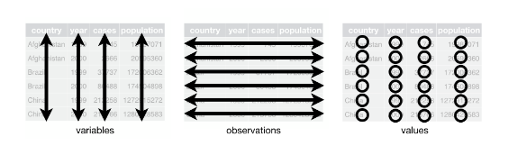

```{r setup, include=FALSE}
options(width = 60)
knitr::opts_chunk$set(echo = TRUE, rows.print=6)

```


## Programme

- The `tidyr` package for restructuring data
- The `stringr` package for working with text variables
- Treatment of dates and times with the `lubridate` package
- Factors / categorical variables


## Packages

Most of our needed packages for this segment are part of the `tidyverse`. We also would like to use `dplyr`, so we will load the entire tidyverse for convenience. 

```{r}
library(tidyverse)
library(lubridate)
library(nycflights13)
```

# "Tidy" data with `tidyr`

## What is "tidy" data?

"Tidy" data is a standardised way of structuring data. There are three main criteria for whether a table can be considered tidy:

1. Every variable must have its own separate column
2. Every observation must have its own row
3. Every value must have its own cell


```{r echo=F, out.width='100%', out.extra='style="float:right; padding:10px"'}

```

## "Untidy" data

Examples of untidy data:

- A column contains values such as "Sydney2019", "Melbourne2020", "Sydney2020"
- Columns exist with the names "Quantity_Sydney", "Quantity_Brisbane,...
- The observations for each city are spread over multiple rows (e.g. a "Population" row and a "Households" row)


## Tidy data, why and how

```{r echo=F, out.width='25%', out.extra='style="float:right; padding:5px"'}
knitr::include_graphics("figures/tidyr_logo.png")
```

- Data isn't always well-structured for our use case. We can do something about this by: 
- Making long-form data wider / wide-form data longer
- Separating one column into multiple columns / combine multiple columns into one
- Dropping observations with missing values / fill in missing values
- Inserting rows to complete the data 


## From long data to wide data

```{r}
table2 %>%  head(8)
```


## From long data to wide data (pivot_wider)

```{r, echo = T}
table2 %>% 
  pivot_wider(names_from = "type", values_from = "count")
```


## From wide data to long data

```{r}
table4a
```

## From wide data to long data (pivot_longer)

```{r, echo=T}
table4a_tidy <- table4a %>%
  pivot_longer(cols = c(`1999`, `2000`), 
               names_to = "year", 
               values_to = "cases")

table4a_tidy
```


## Variables that need to be combined or spread

```{r}
table5
```


## Splitting a variable (separate)

```{r, echo = T}
table5_sep <- table5 %>% 
  separate(col = "rate", into = c("cases", "population"))

table5_sep
```


## Splitting a variable (separate)

```{r, eval=FALSE}
separate(
  data, 
  col, # The column we're splitting
  into, # Names of the columns we want to create
  sep = "[^[:alnum:]]+", # Default is that we split at any character 
  # that isn't a number or letter
  remove = TRUE, # Do we drop the original variable?
  convert = FALSE, # Do we convert the variable type?
  extra = "warn", 
  fill = "warn",
  ...
)
```


## Combining multiple variables (unite)

```{r, echo = T}
table5_sep %>% 
  unite(col = "year", century, year, sep = "") 
```

## Combining multiple variables (unite)

```{r, eval=FALSE}
unite(data, col, ..., sep = "_", remove = TRUE, na.rm = FALSE)
```

`...` stands for the columns you wish to combine


## Missing values 1

```{r}
stocks <- tibble(
  year   = c(2015, 2015, 2015, 2015, 2016, 2016, 2016),
  qtr    = c(   1,    2,    3,    4,    2,    3,    4),
  return = c(1.88, 0.59, 0.35,   NA, 0.92, 0.17, 2.66)
)

stocks
```

- Should missing values be explicit or implicit?

## Missing values 1 (complete)

```{r}

stocks %>% 
  complete(year, qtr)

```


## Missing values 2

```{r}
treatment <- tribble(
  ~ person,           ~ treatment, ~response,
  "Derrick Whitmore", 1,           7,
  NA,                 2,           10,
  NA,                 3,           9,
  "Katherine Burke",  1,           4
)

treatment
```


## Missing values 2 (fill)

```{r, echo=T}

treatment %>% 
  fill(person)

```

# Exercises

# Text manipulation with stringr

## stringr

The `stringr` package gives us tools for working with text strings. 

- More consistent and streamlined than base R 
- Works better with pipes


## Combining strings

`str_c` or `paste` and `paste0` from base R

```{r}

starwars |> 
  mutate(weight_w_text = str_c(name, " weighs ", mass, " kg"), 
         .keep = "used")

```

## Filtering with str_detect

```{r}
starwars |> 
  filter(str_detect(eye_color, "blue")) |> 
  select(name, eye_color)
```

## Filtering with str_detect

```{r}
starwars |> 
  filter(!str_detect(eye_color, "blue")) |> 
  select(name, eye_color)
```

## Filtering with str_detect

```{r}
starwars |> 
  filter(str_detect(name, "[0-9]")) |> 
  select(name, eye_color)
```

## Briefly about regular expressions

`str_detect()` uses regular expressions.

Examples: 

- "A|B" matches either A or B
- "^A" matches strings that start with A
- "A$" matches strings that end with A
- "(A|B)C" matches AC or BC

We won't go deeper into this, but here are some useful links to a [regex intro](https://stringr.tidyverse.org/articles/regular-expressions.html) and an excellent stringr and regex [cheat sheet](https://github.com/rstudio/cheatsheets/blob/main/strings.pdf).

## Editing text strings

```{r}

starwars |> 
  filter(str_detect(string = name, pattern = "Vader|Skywalker")) |> 
  mutate(name_ny = str_remove_all(string = name, 
                                  pattern = "Vader|Skywalker") |> 
           str_trim(),
         .keep = "used")

```

## Editing text strings

```{r}

starwars |> 
  mutate(name_ny = str_replace_all(string = name,
                                   pattern = "[aeiouy]",
                                   replacement = "ö" ),
         .keep = "used")

```

## More stringr

- `str_to_lower`, `str_to_upper`
- `str_sub`
- `str_trim`, `str_squish`, `str_pad`

# Dates with `lubridate`

## Dates

- Dates and times can have the classes `date` and `datetime`
- Underlying data: Seconds since January 1st 1970
- Can add/subtract numbers to/from dates, subtract dates from each other (but can't multiply dates and numbers)
- Datetime can be converted to date with `as.Date` or `as_date`

## The lubridate package

- A more robust and intuitive handling of dates
- Better handling of time zones, Feb 29th, daylight savings time...


```{r echo=F, out.width='20%', out.extra='style="float:right; padding:10px"'}

```

## Creating dates

```{r}
today()
make_date(1960, 04, 01)
ymd(20200301)
dmy("24 October 2022")
```

## Creating datetimes

```{r}
now()
make_datetime(1870, 4, 25, 23, 59, 03)
ymd_hm("2017-10-31 20:11")
```

## Be aware of time zones

```{r}
ymd_hm("2017-10-31 20:11") - ymd_hm("2017-10-31 20:11", tz="CET")
```

##  Time intervals
The difference between two dates/datetimes is a `difftime
```{r}
today() - dmy("11 July 1975")
```

lubridate introduces the type `duration` (which always is seconds in the underlying data)

```{r}
as.duration(dmy("24dec2022") - dmy("23 okt 2022"))
```

## Time intervals - time between dates

```{r}
tibble(date1 = dmy("27FEB2003") + 0:3) |> 
  mutate(age = difftime(dmy("29FEB2024"), date1))
```

difftime has a "units" option, which can be seconds, minutes, hours, days or weeks - not years or months

## Time intervals - time between dates
```{r, echo=FALSE}
options(scipen=1, digits=5)
```

```{r}
tibble(date1 = dmy("27FEB2003") + 0:3) |> 
  mutate(age = difftime(dmy("29FEB2024"), date1) |> 
           time_length(unit = "years") |> 
           floor())
```

## Time intervals - "in x years"

```{r}
tibble(date1 = dmy("27FEB2003") + 0:3) |> 
  mutate(date2 = date1 + years(1), 
         date3 = date1 + years(20))
```

## Time intervals - "in x years"

```{r}
tibble(date1 = dmy("27FEB2004") + 0:3) |> 
  mutate(date2 = date1 + years(1), 
         date3 = date1 + years(20))
```

## Time intervals - "in x months"

```{r}
tibble(date1 = dmy("27FEB2004") + 0:3) |> 
  mutate(date2 = add_with_rollback(date1, months(1)),
         date3 = add_with_rollback(date1, months(12)))
```

## Time intervals - "in x months"

```{r}
tibble(date1 = dmy("27FEB2004") + 0:3) |> 
  mutate(date2 = add_with_rollback(date1, -months(1)),
         date3 = add_with_rollback(date1, -months(12)))
```


# Factors 

## Factors
- Factors are categorical variables
- In the underlying data, they are coded as integers (whole numbers)
- Typically formatted (and displayed) as text strings
- Look like character variables, but act slightly differently 
- A factor only accepts a limited and predefined set of values
- Base R functions often default to loading strings as factors - tidyverse functions don't
- Factors are useful for:
  - Statistical modelling
  - Control over the order of levels
  - Ensuring that input doesn't deviate from predefined values

## Creating factors
- Factors are stored as integers with an assigned text string as a label for display
- Both numeric and character variables can be transformed to factors
- The levels of the categories are ordinal -> we can use factors to control the order when sorting

## Transforming a variable into a factor
```{r}
flights |> 
  mutate(origin_factor = factor(origin),
         .keep = "used")
```


## Setting the order of factor levels

`origin_char` is not a factor, so it is sorted alphabetically:
```{r}
flights |> 
  mutate(origin_char = case_when(origin == "EWR" ~ "Newark Liberty International",
                                 origin == "JFK" ~ "John F. Kennedy International",
                                 origin == "LGA" ~ "LaGuardia")) |> 
  count(origin_char)
```


## Setting the order of factor levels

`origin_factor` is a factor variable and it is sorted by the order of its levels:
```{r}
flights |> 
  mutate(origin_factor = factor(origin,
                                levels = c("EWR", "JFK", "LGA"),
                                labels = c("Newark Liberty International",
                                           "John F. Kennedy International",
                                           "LaGuardia")),
                                .keep = "used") |> 
  count(origin_factor)
```

## Handling factors with forcats

- The `forcats` package contains functions for working with factors
- `fct_collapse` for combining levels within a factor
- `fct_c` for combining factor variables from different sources with different levels
- `fct_expand`/`fct_drop` for adding or removing levels


## Further reading

`tidyr`  
[R4DS - 12 Tidy data](https://r4ds.had.co.nz/tidy-data.html)

`stringr`  
[R4DS - 14 Strings](https://r4ds.had.co.nz/strings.html)

`factors`  
[R4DS - 15 Factors](https://r4ds.had.co.nz/factors.html)

`lubridate`  
[R4DS - 16 Dates and times](https://r4ds.had.co.nz/dates-and-times.html)


# Exercises