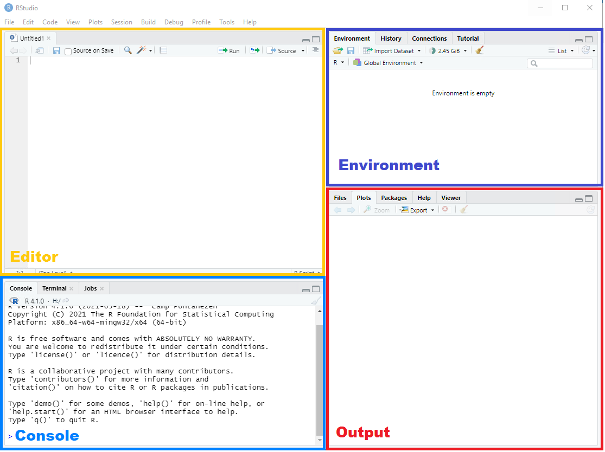

## Use RStudio
<center>

</center>

## Assigning elements to objects
- Assigning things in R is very straightforward: 

    - you just use `<-`

- For example, if you assign the value `100` (an element) to object `a`, you would type

```{r}
a <- 100
```

## Calling objects
- Calling things in R is also very straightforward: 

    - you just use type the name you have given to the object

- For example, we assigned the value `100` to object `a`. To call object `a`, we would type

```{r}
a
```

- Run is CTRL+ENTER

## Datatypes
- Three basic datatypes:
  * Numeric (e.g. double, integer)
  * Character
  * Logical

- You can convert types with `as."datatype"

## Data frames
To keep variables of different types in a 2D structure, the simplest answer is a **data frame**

```{r}
d <- data.frame("V1" = rnorm(50),
                "V2" = rnorm(50, mean = 5, sd = 2), 
                "V3" = letters[1:50])
d
```
## Data frames
- Data frames can contain all datatypes
- Each column can only contain one datatype
- Each row has the same columns
- You call the rows and then the columns:
```{r}
d[3, ]
```

## Tibbles
- The 'tidy' version of a data.frame (from the `tibble` package, a part of `tidyverse`). 
- Extension of a `data.frame` 
- Prettier 'prints'

## Tibbles

This is how you make a tibble:

```{r, echo = FALSE, message = FALSE, warning = FALSE}
library(tidyverse)
```


```{r}
tibble("V1" = rnorm(50),
       "V2" = rnorm(50, mean = 5, sd = 2), 
       "V3" = letters[1:50])
```

## Logical operators
- Logical operators are operators that evaluate to either `TRUE` or `FALSE`
- The most common statement include
    - `==` (equal to)
    - `<` (smaller than)
    - `>` (greater than)
    - `<=` (smaller than or equal to)
    - `>=` (greater than or equal to)
    
## Logical operators
- The operators may be combined using `|` (OR) as well as `&` (AND)
- Typing `!` before a logical operator takes the complement of that action
- There are more operations, but these are the most useful 
- Remember this for filtering

## Packages
Installation:
```{r, eval = FALSE}
install.packages("mice")
```

## Packages
Load it:
```{r message = FALSE}
library(mice)
```

 - New packages are installed with the function `install.packages`.
 - It searches the CRAN-repository for packages with the provided name.
 
## Important packages
```{r}
library(readr)
library(haven)
library(openxlsx)
library(tidyverse)
```
 - If it does not work - try to install it again, then load, then run
 
## Path to files
 - When you start R it has a Working Directory. It is either your systems userdirectory or the directory of your project.
 - To see your current Working Directory use the function `getwd`:
```{r eval = FALSE}
getwd()
```
```{r echo = F}
"C:/Users/Jolien"
```

- R will first look for files in your Working Directory
- In a project the working directly is automatically set to the folder the project is located in

## Path to files
- Either you move the file to the Working Directory
- Alternatively I could write the full path, notice that we use slash (/) and not backslash(\\):
```{r eval = F}
file("C:/Users/Jolien/example.txt")
```

## Writing to files
Can be simple:
```{r}
# CSV (using the package readr)
readr::write_csv2(boys, "boys.csv")

# Excel (using the package openxlsx)
openxlsx::write.xlsx(boys, "boys.xlsx")

# STATA (using the package haven)
haven::write_dta(boys, "boys.dta")
```

## Reading from files
Also simple:
```{r message = F}
# CSV
boys_csv <- readr::read_csv2("boys.csv")

# Excel
boys_xlsx <- openxlsx::read.xlsx("boys.xlsx")
```
- Notice that we use `read_csv2` and not `read_csv`.
- This uses `;` to separate values instead of `,` which can be problematic in our region.
- Always inspect your data after importing - it could change data type!

## The pipe
The pipe `|>` pulls everything to the left of it through the pipe and inserts it into the first argument of the function on the right-hand side. You can think of it as **...and then ...**

- CTRL+SHIFT+M

- The old version: `%>%`

## Select: Selecting columns in your dataset
```{r, message=FALSE}
library(nycflights13)
library(dplyr)
# or:
library(tidyverse)
```

```{r, echo = TRUE, }
flights |> 
  select(carrier, dest)
```

## Deselect: Drop columns from your dataset
**deselect / drop**  
```{r}
flights |> 
  select(-month, -day)
```

## Renaming columns

```{r}
flights |> 
  rename(departure = dep_time)
```

## Filter (select rows)
```{r}
flights |> 
  filter(distance > 1000) 
```

## Filter on more conditions

Use `&` (and) or `|` (or) to filter the data on multiple conditions

```{r}
flights |> 
  filter(distance > 1000 & month == 12)
```

## Creating new variables

**mutate**

```{r}
flights |> mutate(arr_delay = if_else(arr_delay > 0, "YES", "NO"), 
                  distance_km = 1.61 * distance,
                  .keep = "used")
```

## Mutate: if_else and case_when

```{r, eval=TRUE}
flights |> 
  mutate(arr_delay = if_else(arr_delay > 0, "YES", "NO"),
         flight_type = case_when(distance < 500 ~ "Short flight",
                                 air_time > 180 ~ "Long flight",
                                 TRUE ~ "Medium flight"),
         .keep = "used")
```

## Left_join

Joining the airlines with the flights2 dataset based on the 'carrier' column.

```{r}
flights2 <- flights |> select(year:day, hour, tailnum, carrier)

flights2 |> 
  left_join(airlines, by = "carrier")
```
- You can join by multiple variables

# Let us see how it works

# Further main points
## Missingness - Not Available
Unknown values are coded as `NA`/"Not Available":
```{r}
h <- c(1, 2, NA, 4, 5)
h
```
This is a special type that can be included in all vectors:
```{r}
j <- c("A", "B", NA, "D")
j
```

## Missing values 1

```{r}
stocks <- tibble(
  year   = c(2015, 2015, 2015, 2015, 2016, 2016, 2016),
  qtr    = c(   1,    2,    3,    4,    2,    3,    4),
  return = c(1.88, 0.59, 0.35,   NA, 0.92, 0.17, 2.66)
)

stocks
```

- Should missing values be explicit or implicit?

## Missing values 1 (complete)

```{r}

stocks %>% 
  complete(year, qtr)

```


## Missing values 2

```{r}
treatment <- tribble(
  ~ person,           ~ treatment, ~response,
  "Derrick Whitmore", 1,           7,
  NA,                 2,           10,
  NA,                 3,           9,
  "Katherine Burke",  1,           4
)

treatment
```


## Missing values 2 (fill)

```{r, echo=T}

treatment %>% 
  fill(person)

```


## From long data to wide data

```{r}
table2 %>%  head(8)
```

## From long data to wide data (pivot_wider)

```{r, echo = T}
table2 %>% 
  pivot_wider(names_from = "type", values_from = "count")
```


## From wide data to long data

```{r}
table4a
```

## From wide data to long data (pivot_longer)

```{r, echo=T}
table4a_tidy <- table4a %>%
  pivot_longer(cols = c(`1999`, `2000`), 
               names_to = "year", 
               values_to = "cases")

table4a_tidy
```


## Variables that need to be combined or spread

```{r}
table5
```


## Splitting a variable (separate)

```{r, echo = T}
table5_sep <- table5 %>% 
  separate(col = "rate", into = c("cases", "population"))

table5_sep
```


## Combining strings

`str_c` or `paste` and `paste0` from base R

```{r}

starwars |> 
  mutate(weight_w_text = str_c(name, " weighs ", mass, " kg"), 
         .keep = "used")

```

## Filtering with str_detect

```{r}
starwars |> 
  filter(str_detect(eye_color, "blue")) |> 
  select(name, eye_color)
```

## Editing text strings

```{r}

starwars |> 
  filter(str_detect(string = name, pattern = "Vader|Skywalker")) |> 
  mutate(name_ny = str_remove_all(string = name, 
                                  pattern = "Vader|Skywalker") |> 
           str_trim(),
         .keep = "used")

```

## Editing text strings

```{r}

starwars |> 
  mutate(name_ny = str_replace_all(string = name,
                                   pattern = "[aeiouy]",
                                   replacement = "ö" ),
         .keep = "used")

```

# Dates with `lubridate`

## Dates

- Dates and times can have the classes `date` and `datetime`
- Underlying data: Seconds since January 1st 1970
- Can add/subtract numbers to/from dates, subtract dates from each other (but can't multiply dates and numbers)
- Datetime can be converted to date with `as.Date` or `as_date`

## The lubridate package

- A more robust and intuitive handling of dates
- Better handling of time zones, Feb 29th, daylight savings time...

## Creating dates

```{r}
today()
make_date(1960, 04, 01)
ymd(20200301)
dmy("24 October 2022")
```

## Creating datetimes

```{r}
now()
make_datetime(1870, 4, 25, 23, 59, 03)
ymd_hm("2017-10-31 20:11")
```

## Be aware of time zones

```{r}
ymd_hm("2017-10-31 20:11") - ymd_hm("2017-10-31 20:11", tz="CET")
```
